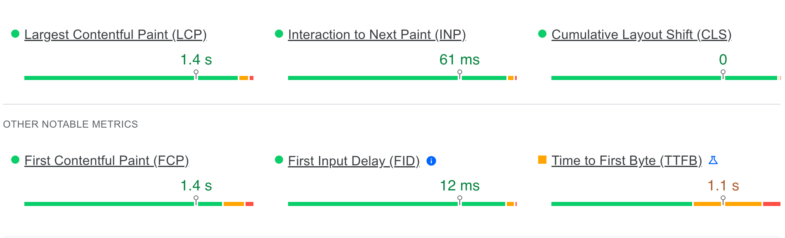

# 🚀 PageSpeed PHP API Client

[](https://github.com/smnandre/pagespeed-api/blob/main/composer.json)
[](https://github.com/smnandre/pagespeed-api/actions)
[](https://github.com/smnandre/pagespeed-api/releases)
[](https://github.com/smnandre/pagespeed-api/blob/main/LICENSE)
[](https://codecov.io/gh/smnandre/pagespeed-api)

This PHP library offers an effortless way to leverage Google's [PageSpeed Insights](https://pagespeed.web.dev/) API. 

Analyze your web pages for performance metrics, get detailed reports, and optimize your site with ease. 🚀

## Installation

```shell
composer require smnandre/pagespeed-api
```

## Usage

### Initialize the API

```php
use PageSpeed\Api\PageSpeedApi;

$pageSpeedApi = new PageSpeedApi();

// or with API key (optional)
$pageSpeedApi = new PageSpeedApi('YOUR_API_KEY');
```

### Run analysis

```php
// Analyze a page
$analysis = $pageSpeedApi->analyse('https://example.com/');

// ...with a specific strategy (mobile or desktop)
$analysis = $pageSpeedApi->analyse('https://example.com/', 'mobile');

// ...with a specific locale (e.g., fr_FR)
$analysis = $pageSpeedApi->analyse('https://example.com/', locale: 'fr_FR');

// ...with a specific category (performance, accessibility, best-practices, seo)
$analysis = $pageSpeedApi->analyse('https://example.com/', categories: 'performance');
```

#### Parameters

| Parameter | Description                                                              | Default |
|-----------|--------------------------------------------------------------------------|---------|
| `url`     | The URL of the page to analyze.                                          | - |
| `strategy` | The analysis strategy to use. Possible values are `mobile` or `desktop`. | `mobile` |
| `locale` | The locale to use for the analysis.                                      | `en` |
| `categories` | The categories to analyze. If not specified, all categories will be analyzed. | - |

## Audit Scores


```php
use PageSpeed\Api\PageSpeedApi;

$pageSpeedApi = new PageSpeedApi();
$analysis = $pageSpeedApi->analyse('https://www.example.com');

$scores = $analysis->getAuditScores();

// array (
//   'performance' => 100,
//   'accessibility' => 88,
//   'best-practices' => 100,
//   'seo' => 90,
// )
```

### Audit categories

| #  | Category           | Description                                                                          |
|----|--------------------|--------------------------------------------------------------------------------------|
| ⚡  | **Performance**    | Measures how quickly the content on your page loads and becomes interactive.         |
| 🌍 | **Accessibility**  | Evaluates how accessible your page is to users, including those with disabilities.   |
| 🏆 | **Best Practices** | Assesses your page against established web development best practices.               |
| ⚓  | **SEO**            | Analyzes your page's search engine optimization, ensuring it follows SEO guidelines. |


### Score Evaluation

| Min | Max | ⬜️                     | Description       | 
|-----|-----|------------------------|-------------------|
| 0   | 49  | 🟥🟥🟥🟥🟥⬜️⬜️⬜️⬜️⬜️ | Poor              | 
| 50  | 89  | 🟧🟧🟧🟧🟧🟧🟧🟧🟧️⬜️️ | Needs improvement |
| 90  | 100 | 🟩🟩🟩🟩🟩🟩🟩🟩🟩🟩 | Good              |


## Core Web Vitals



### Loading Metrics

```php
use PageSpeed\Api\PageSpeedApi;

$pageSpeedApi = new PageSpeedApi();
$analysis = $pageSpeedApi->analyse('https://www.example.com');

$metrics = $analysis->getLoadingMetrics();

// array (
//   'CUMULATIVE_LAYOUT_SHIFT_SCORE' => 'FAST',
//   'EXPERIMENTAL_TIME_TO_FIRST_BYTE' => 'AVERAGE',
//   'FIRST_CONTENTFUL_PAINT_MS' => 'FAST',
//   'FIRST_INPUT_DELAY_MS' => 'FAST',
//   'INTERACTION_TO_NEXT_PAINT' => 'FAST',
//   'LARGEST_CONTENTFUL_PAINT_MS' => 'FAST',
// )
```

### Main Metrics

| # | Abbr | Metric                        | Description                                                                                      |
|------|--------------|-------------------------------|--------------------------------------------------------------------------------------------------|
| 🖼️   | **FCP**      | **First Contentful Paint**    | Time taken for the first piece of content to appear on the screen.                                |
| 📏   | **SI**       | **Speed Index**               | How quickly the contents of a page are visibly populated.                                         |
| 📊   | **CLS**      | **Cumulative Layout Shift**   | Measure of visual stability; the sum of all individual layout shift scores.                        |
| ⏳   | **LCP**      | **Largest Contentful Paint**  | Time taken for the largest content element to appear.                                             |
| ⏱️ | **INP** | Interaction to Next Paint | The time from when a user interacts with a page (e.g., clicks a button) to the next time the page visually updates in response to that interaction. |


## Contributing

Contributions are welcome! If you would like to contribute, please fork the repository and submit a pull request. 

## License

This project is licensed under the MIT License. See the LICENSE file for more information.
